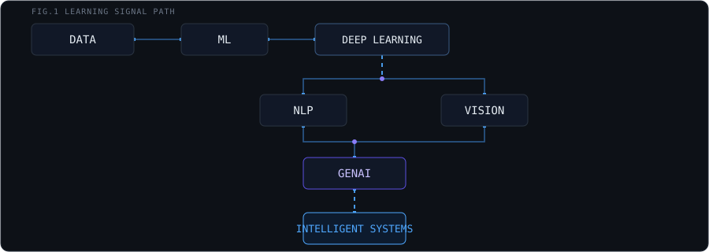
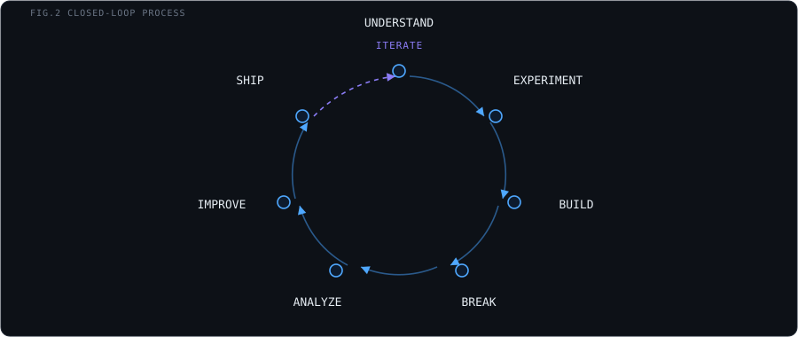
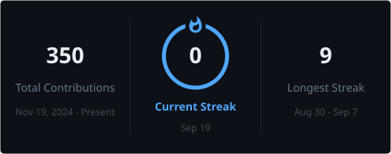

  

 

I’m **Bhavya Modi**, a B.Tech Information Technology student specializing in **Data Science & Analytics**. I’m interested in understanding how things work under the hood and turning what I learn into something I can actually build.

Most of my time goes into **Machine Learning, Deep Learning, NLP, Generative AI, and Data Science**, along with the software engineering needed to turn those ideas into working applications. I enjoy moving between data, models, APIs, and interfaces rather than keeping everything inside a notebook.

I learn best by building. I like taking a concept, experimenting with it, breaking things along the way, figuring out why they broke, and then making it better. That process is what keeps me interested in AI and ML.

 

### `§ FOCUS`

The things I’m working on are connected — from understanding data and ML fundamentals to exploring deeper models, NLP, and generative AI, and eventually putting those pieces together into useful systems.

 

### `§ STACK`

<table>
<tr><td><b>LANGUAGES</b></td><td>Python, C++, JavaScript, SQL</td></tr>
<tr><td><b>ML / DL</b></td><td>PyTorch, TensorFlow, Scikit-learn</td></tr>
<tr><td><b>DATA</b></td><td>Pandas, NumPy</td></tr>
<tr><td><b>BACKEND</b></td><td>FastAPI, Node.js, MongoDB, Firebase</td></tr>
<tr><td><b>FRONTEND</b></td><td>React</td></tr>
<tr><td><b>INFRA</b></td><td>Docker, Git, GitHub</td></tr>
</table>

 

### `§ PROCESS`

I don’t expect the first version to be perfect. I’d rather build something, find where it falls apart, understand why, and keep going until it actually makes sense.

 

### `§ CURRENTLY EXPLORING`

I’m currently going deeper into **Machine Learning and Deep Learning**, while exploring **NLP and Generative AI**. I’m especially interested in what happens behind the APIs — how models work, how they are used in real systems, and how all the pieces come together.

 

### `§ TELEMETRY`

      

Generated once a day by a workflow in this repo (<code>.github/workflows/telemetry.yml</code>) and committed as static files — no live third-party call, so it can't go down or hit a rate limit. If it's ever stale, the source is the <a href="https://github.com/bhavya277?tab=repositories">repositories tab</a>.

    
 <table> <tr><td><b>LEARNING</b></td><td>ACTIVE</td></tr> <tr><td><b>BUILDING</b></td><td>ACTIVE</td></tr> <tr><td><b>DIRECTION</b></td><td>AI / ML</td></tr> </table>

<a href="https://github.com/bhavya277">GitHub</a> · <a href="https://www.linkedin.com/in/bhavya-modi-9a9b28312">LinkedIn</a> · <a href="https://bhavyamodi27.vercel.app/">Portfolio</a>

